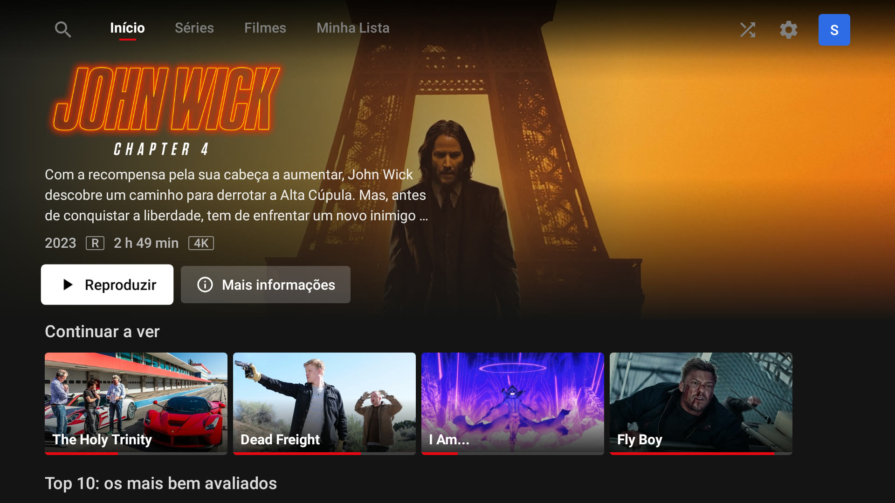
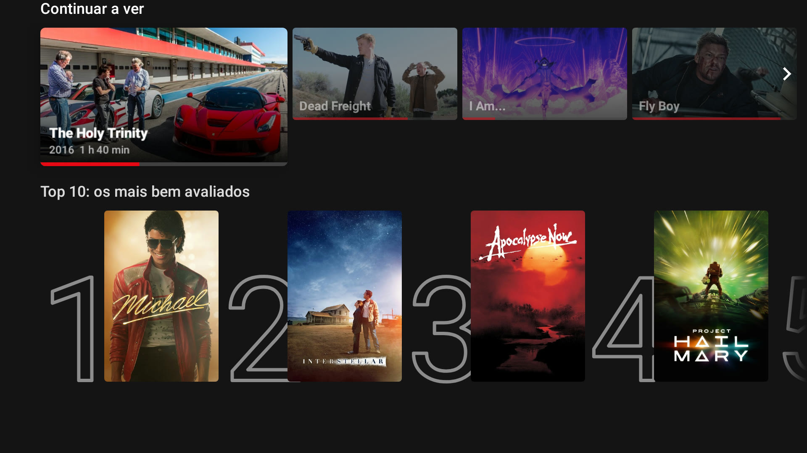
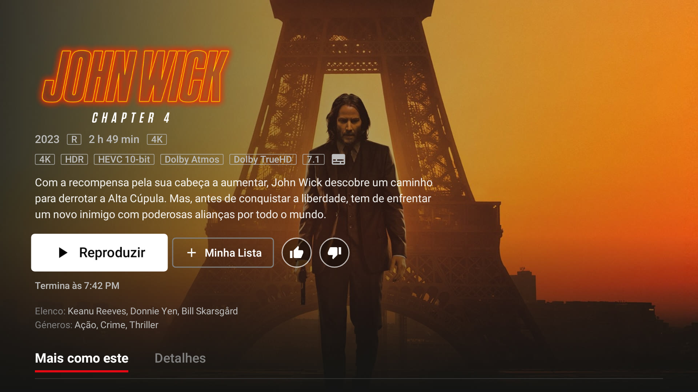
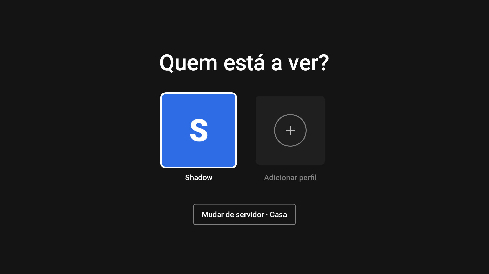
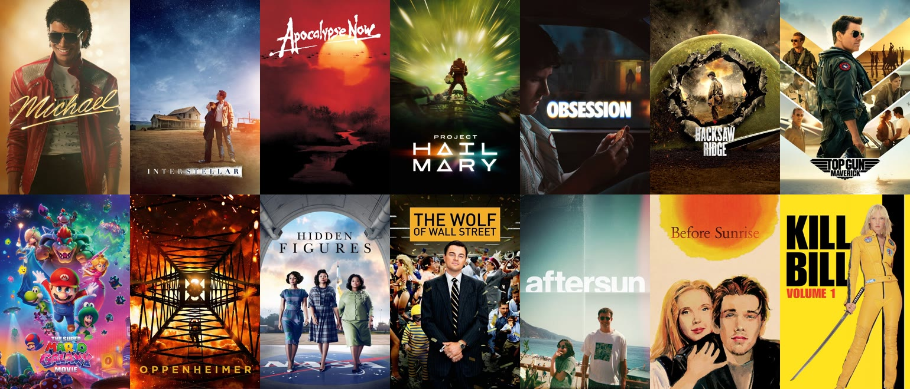

<h1 align="center">Jellyflix</h1>

  O teu servidor <a href="https://jellyfin.org">Jellyfin</a> na TV da sala, com a cara e o jeito da Netflix. 
  Cliente para <strong>Android TV</strong> escrito de raiz em Kotlin e Compose for TV.

  
  
  

  

> Projeto pessoal, feito para a TV da sala. Funciona todos os dias — com uma biblioteca de 206 filmes, 71 séries e
> 2441 episódios —, mas é uma app de uso próprio: não está na Play Store, instala-se pelo APK e foi testada num
> servidor e num punhado de televisores, não em todos.

## Como se vê

<table>
  <tr>
    <td width="50%"></td>
    <td width="50%"></td>
  </tr>
  <tr>
    <td align="center">Linhas de cartões que crescem com o foco, e Top 10 numerado</td>
    <td align="center">Detalhes com o que o ficheiro tem por dentro: 4K, HDR, Atmos, 7.1…</td>
  </tr>
  <tr>
    <td width="50%"></td>
    <td width="50%"></td>
  </tr>
  <tr>
    <td align="center">«Quem está a ver?», um perfil por pessoa</td>
    <td align="center">A biblioteca inteira, com as capas do próprio servidor</td>
  </tr>
</table>

As imagens são capturas da própria interface da app, geradas em testes com metadados e capas reais do servidor
do autor. As capas pertencem aos respetivos detentores.

## O que faz

**Navegar como na Netflix.** Menu superior com as secções, destaque que roda sozinho e toca o trailer, cartões 16:9
que abrem com o foco e mostram o preview lá dentro, Top 10 numerado, «Reproduzir algo», Minha Lista e grelha por
género. Os menus, os teclados no ecrã e o comportamento do Back seguem o que se espera numa TV — nenhum clique se
perde e a primeira tecla nunca é gasta só a tirar o foco de um grupo.

**Um leitor que aguenta a biblioteca toda.** Reprodução direta sempre que a TV consegue, conversão no servidor só
quando é mesmo preciso, e o FFmpeg a tratar do áudio que a TV não descodifica (DTS, TrueHD…). Passthrough por HDMI
quando o recetor trata do som, com opção para o desligar e ter sempre volume ajustável. A qualidade baixa sozinha
quando a ligação não aguenta, em vez de o vídeo ficar aos soluços, e o buffer é dimensionado à memória da TV para
um ficheiro de 19 GB não a rebentar.

**Saltar introduções, resumos e créditos.** Lê os Media Segments do servidor, os endpoints do plugin Intro Skipper,
o TheIntroDB e os capítulos do próprio ficheiro — e, sem nada disso, ainda oferece um salto estimado nos primeiros
minutos de um episódio. Pode saltar sozinho, e o cartão do próximo episódio aparece nos créditos.

**Trailers dentro da app.** O trailer do YouTube toca no leitor, com o som original e sem sair da app, em vez de
abrir outra aplicação e perder o comando.

**TV em Direto.** Canais com logótipo numa linha de cartões, destaque do canal focado com o programa a dar agora e a
programação do dia ao lado.

**Controlo remoto pelos outros clientes.** A app móvel ou a web do Jellyfin podem mandar reproduzir, pausar, parar
e saltar nesta TV, pelo WebSocket do próprio servidor (nada de Cast nem DLNA).

**Ver em grupo e à distância.** «Reproduzir aqui» a partir do telemóvel, lista de sessões abertas no servidor e SyncPlay
para ver o mesmo título, ao mesmo tempo, com outros ecrãs. Velocidade de reprodução de 0,75× a 2×.

**Perfis com PIN.** Um PIN numérico opcional por perfil, guardado só na TV, com teclado só de números.

**Mais formas de descobrir.** Géneros, estúdios, coleções e a lista «Para ver juntos», tudo no mesmo menu.

**E ainda:** Quick Connect, pesquisa com géneros, pessoas e voz, legendas embutidas e PGS em reprodução direta,
«Ainda estás a ver?», estatísticas para nerds no leitor, proteção de ecrã, descoberta do servidor na rede local,
«Continuar a ver» no ecrã inicial da TV, géneros com nomes repetidos juntos num só e atualizações automáticas.

## Precisa de

- **Servidor Jellyfin 12.0** ou mais recente.
- **Android TV 6.0** (API 23) ou mais recente — TVs, caixas e sticks. É uma app de TV (leanback), não serve para
  telemóveis.

## Instalar

1. Descarrega o APK da [última release](https://github.com/ST-DEVPT/Jellyflix/releases/latest).
2. Passa-o para a TV — por exemplo com o [Downloader](https://www.aftvnews.com/downloader/), com o
   `adb install -r jellyflix-<versão>.apk`, ou por uma pen.
3. Abre a app, escolhe o servidor (a app procura-o na rede) e entra com o teu utilizador.

A partir daí a app avisa-te das versões novas ao arrancar e instala-as sozinha, desde que o APK novo esteja
assinado com a mesma chave. Também podes procurar à mão em Definições › Procurar atualizações.

## Como está feito

Kotlin · Compose for TV (`androidx.tv:tv-material`) · Navigation3 · Hilt · [Jellyfin SDK Kotlin](https://github.com/jellyfin/jellyfin-sdk-kotlin)
1.9 · Media3/ExoPlayer com [NextLib](https://github.com/anilbeesetti/nextlib) (FFmpeg) · Coil 3 · Room e DataStore.

## Saltar introdução, resumo e créditos

O botão aparece quando se sabe onde estão esses segmentos. A app procura, por esta ordem:

1. **Media Segments do servidor** — instala o plugin [Intro Skipper](https://github.com/intro-skipper/intro-skipper)
   (repositório `https://raw.githubusercontent.com/intro-skipper/manifest/main/12/manifest.json` para o Jellyfin 12)
   e corre as tarefas agendadas *Detect Intros* e *Media Segment Scan*;
2. **endpoints antigos do Intro Skipper**;
3. **[TheIntroDB](https://theintrodb.org)**, pelo ID do TMDB (ligado por omissão; desliga-se em Definições › Este
   televisor);
4. **capítulos do ficheiro**, com nomes como «Intro», «Opening», «Recap» ou «Credits»;
5. sem nada disto, um **salto estimado** nos primeiros minutos do episódio (nunca automático — é um palpite).

Em *Estatísticas*, dentro do leitor, vê-se o que cada fonte deu («plugin não instalado», «sem ID do TMDB», …).

## Créditos

Obrigado ao [Jellyfin](https://jellyfin.org) e a quem mantém o SDK, ao Media3, ao NextLib e ao
[NewPipeExtractor](https://github.com/TeamNewPipe/NewPipeExtractor) (trailers do YouTube dentro da app).

---

*Projeto pessoal, sem qualquer ligação ao Jellyfin nem à Netflix. «Netflix» é uma marca registada da Netflix, Inc.,
usada aqui apenas para descrever a inspiração da interface.*
